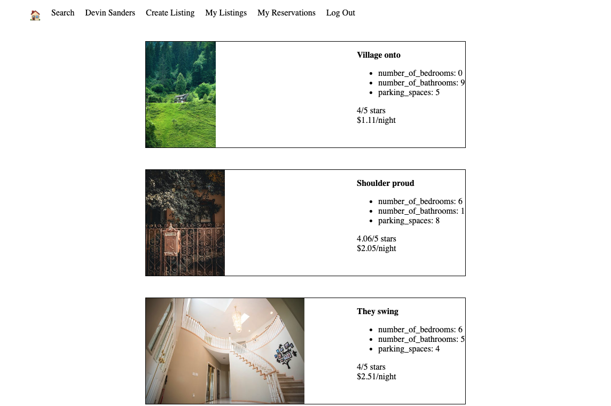
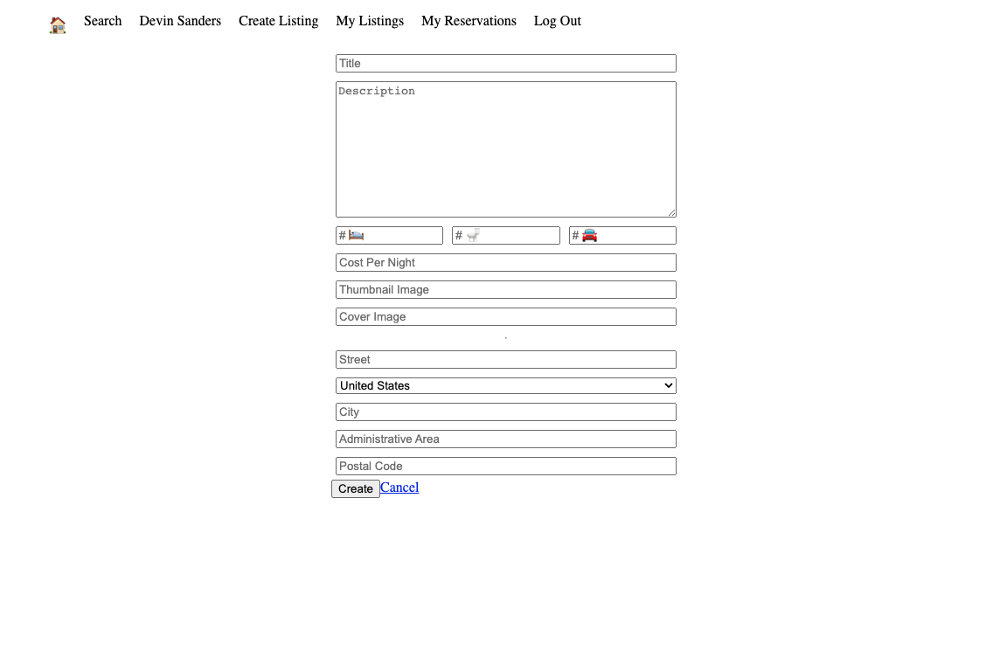
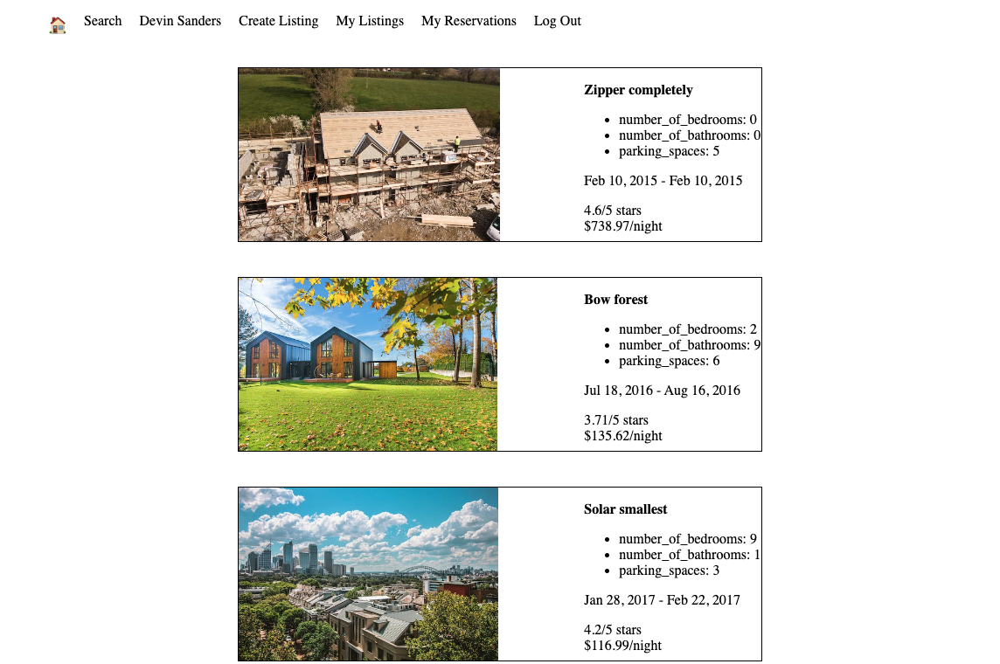
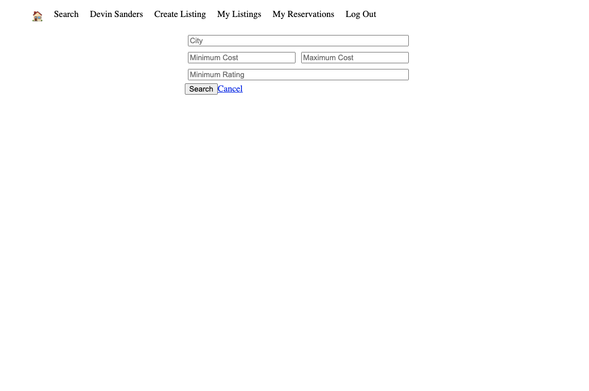

LightBnb is a unique and cool website that lets you book your next vacation easily! With LightBnB you can search for places to stay with family friends or loved ones near your location and also filter out the quilities you would like to your own preference!

This project mainly focused on buidling and showing our SQL skills and learning how to write proper queries.

